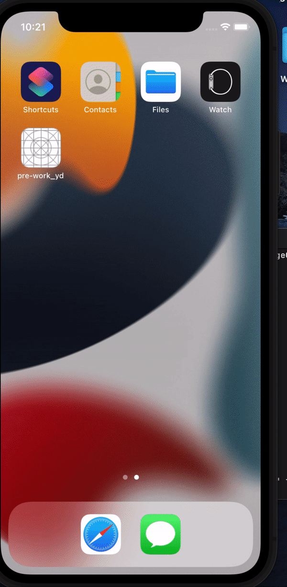

# ChangeColoriOSApp
## Yilenda's ChangeColoriOSApp

### App Description
This app simulates an app home page that features a custom background color (red) and a button that when pushed, delivers a welcome message to the user in the output and alters the color of the background at the same time.

### App Walk-though

 

### Required User Stories
- [X] 1. User sees custom text in a label - Hello from {Yilenda}!
- [X] 2. User see's custom background color.
- [X] 3. User can tap a button to change the text color of the label.

